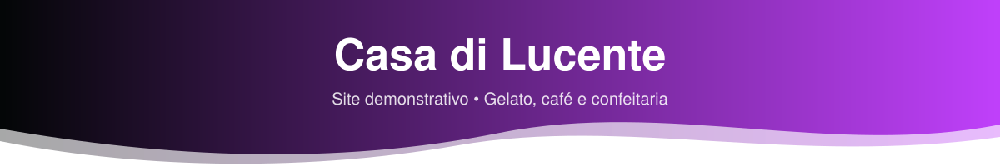
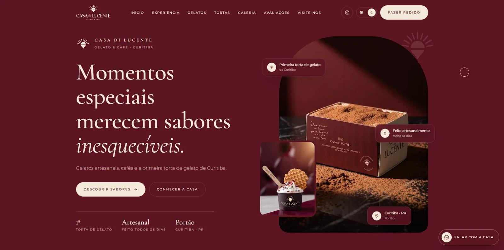

<p align="center">
  
</p>

<p align="center">
  
  
  
  
</p>

<p align="center">
  Demo de site próprio para uma gelateria, cafeteria e confeitaria real de Curitiba, criada como proposta
  comercial para mostrar como a marca poderia ir além do Instagram e do Linktree.
</p>

<p align="center">
  <a href="https://lorenzo-or7.github.io/casa-di-lucente-demo/"><b>🔗 Acessar o site</b></a>
</p>

---

## 🖥️ Preview

<p align="center">
  
</p>

---

## 📌 Sobre o projeto

A presença digital da Casa di Lucente se resumia ao Instagram e a um Linktree. Não havia um lugar próprio
que valorizasse os produtos, contasse a história da marca e facilitasse o contato com os clientes.

A proposta foi criar um site que funcionasse como uma apresentação concreta para o estabelecimento,
com cardápio, disponibilidade do dia e contato direto. O design parte da identidade da própria marca,
com **bordô** e **creme**, numa estética elegante, artesanal e moderna, inspirada em gelaterias e cafeterias premium.

---

## ✨ Funcionalidades

- 🍰 Apresentação da marca, com a torta de gelato mostrada camada por camada
- 📋 Cardápio visual com filtros por categoria
- ✅ Produtos disponíveis e esgotados do dia
- 🎬 Galeria de fotos e vídeos em loop automático
- ⭐ Avaliações de clientes
- 📍 Localização e horários
- 📲 Integração com WhatsApp e QR Code demonstrativo
- 🌗 Tema claro e escuro, com animações
- 🛠️ Simulação de painel de gerenciamento do cardápio
- 📱 Interface responsiva

---

## 🛠️ Tecnologias

Todo o site foi construído em um único arquivo HTML:

- **HTML5** para a estrutura
- **CSS3** para identidade visual, responsividade, temas e animações
- **JavaScript** para troca de tema, filtros, modais e demais interações
- **GitHub Pages** para hospedagem

---

## ⚙️ Como rodar

Não precisa instalar nada: baixe o repositório e abra o arquivo `index.html` no navegador.

```bash
git clone https://github.com/lorenzo-or7/casa-di-lucente-demo.git
```

> Este é um projeto demonstrativo: algumas funcionalidades são simuladas, pois o objetivo é apresentar o conceito antes de uma versão definitiva.

---

## 👨‍💻 Autor

<p>
  Feito por <b>Lorenzo Orsetti</b><br/>
  <a href="https://lorenzo-or7.github.io">
    
  </a>
  <a href="https://www.linkedin.com/in/lorenzo-orsetti-031906349/">
    
  </a>
  <a href="https://github.com/lorenzo-or7">
    
  </a>
</p>

<p align="center">
  
</p>
